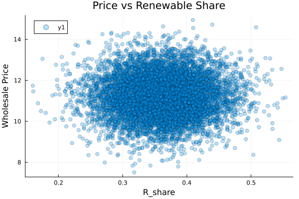
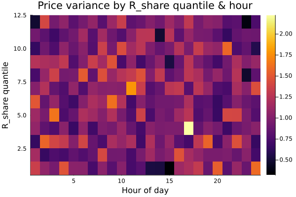
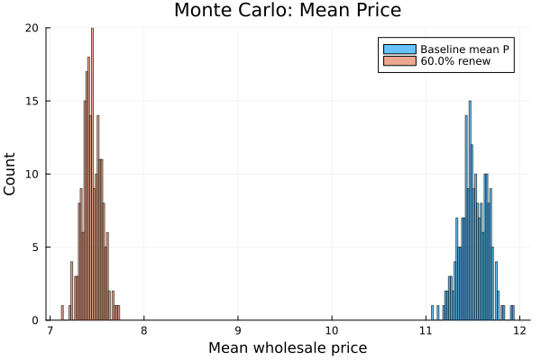
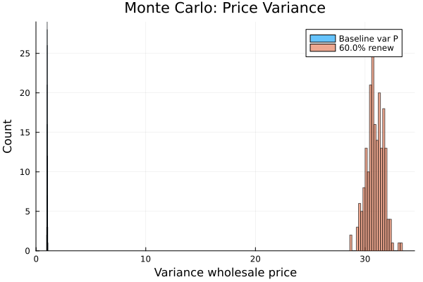
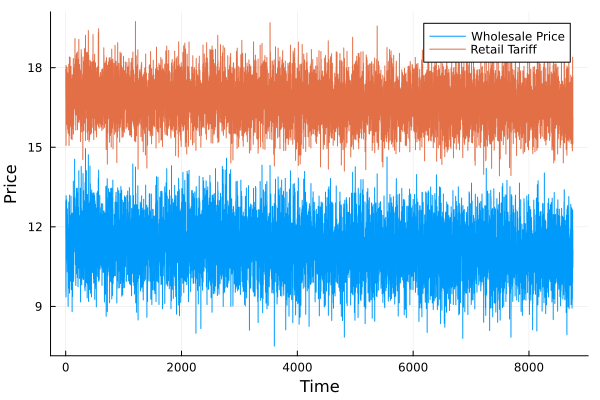

Modeling Electricity Prices and Tariff Dynamics Under Renewable Penetration
=======================================================================

> **Core research deliverable: reproducible results that quantify how renewable penetration changes wholesale price levels, price volatility, and retail tariff stability.**

How does increasing renewable penetration affect wholesale electricity price mean and volatility, and what are the implications for retail tariff stability under realistic pass‑through?

Key hypotheses:
- Increased renewable share reduces mean wholesale prices (merit-order effect).
- Increased renewable share increases price variance (more zero-price hours + occasional scarcity spikes).
- Incomplete or lagged pass-through dampens retail tariff volatility but may introduce cross-subsidy and risk.


Abstract
--------
This repository supplies a compact, reproducible Julia framework for examining how increasing penetration of variable renewable generation affects wholesale electricity price levels and volatility, and how those wholesale dynamics translate into retail tariff outcomes under simple pass-through rules. The implementation combines a transparent merit-order pricing rule, synthetic (or ingested) time series for demand and renewable output, volatility diagnostics (including an hourly × renewable-share heatmap), GARCH estimation, and Monte Carlo scenario analysis (e.g., 60% renewables). The primary deliverables are reproducible figures and CSV summaries in `results/`.

1. Introduction
---------------
Understanding the interaction between renewable penetration and electricity price formation is essential for market design, risk management, and regulatory policy. We provide an interpretable structural model that reproduces two widely discussed effects: (i) the merit-order effect (declining average wholesale prices) and (ii) increased price intermittency and extreme spikes arising from residual demand dynamics. We quantify these effects with empirical-style diagnostics and scenario simulations designed for reproducible research.

2. Model specification
----------------------
Wholesale price is constructed from residual demand and marginal thermal costs using a parsimonious merit-order rule. Denote demand $D_t$, renewable output $R_t$, gas price $P^{gas}_t$, and carbon price $\tau_t$. Residual demand is $x_t=D_t-R_t$. The implemented rule is:

$$
P_t = \begin{cases}
HR\cdot P^{gas}_t + \tau_t\cdot EI, & x_t > Q_{baseload}, \\
0, & x_t \le Q_{baseload}.
\end{cases}
$$

Retail tariff is modeled as a linear pass-through:

$$
T_t = \alpha P_t + \beta,
$$
where $\alpha$ (pass-through) is estimated by OLS and $\beta$ is a fixed charge. The code supports constructing synthetic tariff series for demonstration and estimating $\alpha$ from data.

3. Data and synthetic generator
-------------------------------
The codebase provides `synthetic_data` to generate hourly series (default one year) for demand, renewable output, gas price and a slowly varying carbon price. For applied work, replace the synthetic generator with cleaned market data from ENTSO‑E, EPEX SPOT or Nord Pool. Required fields are `ts, D, R, P_gas, tau` and units must be consistent.

4. Methods
----------
- Renewable share: $R_{share,t}=R_t/D_t$. We compute summary statistics (mean, variance) of $P_t$ conditional on quantiles of $R_{share}$.
- Volatility heatmap: compute price variance across hour-of-day × renewable-share quantile cells to reveal temporal-regime structure of volatility.
- GARCH: fit an ARCH(1,1) model to log returns of $P_t$ to characterize conditional volatility dynamics.
- Monte Carlo scenario analysis: stochastic repeats with either scaling of renewables or direct scenario specification (e.g., mean renewable share = 60%). Compare distributions of mean and variance across draws; compute tail risk metrics (percentiles, CVaR).

5. Results (central figures)
---------------------------
All figures are reproducible by running `scripts/extended_analysis.jl`. Below we present the primary results and concise inferences suitable for inclusion in manuscripts.

Figure 1. Price vs Renewable Share



Caption: Scatter plot of hourly wholesale price $P_t$ against renewable share $R_{share,t}$. The conditional mean declines with $R_{share}$ while the distribution develops heavier tails at certain ranges, indicating retained spike risk despite lower averages.

Inference: The merit-order effect reduces average prices; however, tails remain and spike frequency can increase in particular residual-demand regimes.

Figure 2. Volatility heatmap (hour × renewable-share quantile)



Caption: Heatmap of empirical price variance for each hour-of-day (columns) versus renewable-share quantile (rows). High variance clusters indicate temporal windows and renewable regimes where scarcity-induced price spikes are more likely.

Inference: Volatility risk is structured both temporally (specific hours) and by regime (renewable share), suggesting targeted hedging or capacity mechanisms could mitigate peak risk.

Figure 3. Monte Carlo: 60% renewables — mean price comparison



Caption: Overlaid histograms of Monte Carlo simulated mean wholesale prices under baseline and 60% renewable scenarios.

Inference: The scenario with 60% renewables reduces the central tendency of mean prices but results overlap indicates remaining uncertainty; report Δmean and confidence intervals from `results/monte_carlo_compare_60.csv`.

Figure 4. Monte Carlo: 60% renewables — variance comparison



Caption: Overlaid histograms of Monte Carlo simulated price variances under baseline and 60% renewables.

Inference: Many Monte Carlo draws show increased variance under higher renewable penetration, confirming the hypothesis that mean downward pressure can coexist with higher volatility.

Figure 5. Retail tariff vs wholesale price timeseries



Caption: Example hourly series of wholesale price and constructed retail tariff with linear pass-through (illustrative α≈0.6). Fixed charge reduces short-run household bill variability but does not remove supplier exposure to spikes.

Inference: Linear pass-through with a fixed charge smooths consumer bills but transfers residual volatility and tail risk to suppliers or balancing mechanisms.

6. Reproducibility and usage
---------------------------
To reproduce the figures above, execute the following in the project root:

```bash
julia --project=. -e 'using Pkg; Pkg.instantiate(); Pkg.precompile()'
julia --project=. scripts/simulate.jl
julia --project=. scripts/analysis.jl
julia --project=. scripts/extended_analysis.jl
```

Output files and formats are documented in Section IV of this repository. For production analysis, replace `synthetic_data` with curated market data and calibrate `HR` and `EI` to fleet characteristics.

7. Limitations and extensions
-----------------------------
- The current merit-order rule is stylized and omits intra-day unit commitment, reserve constraints, and market bidding behavior. Use market-level supply curves and unit commitment models for higher fidelity.
- Tariff formulation is linear; extending to lagged pass-through, time-of-use tariffs, or retail hedging contracts is straightforward within the code base.
- Future work: ingest ENTSO‑E/EPEX/Nord Pool, calibrate heat rates/emissions, incorporate spatial coupling between bidding zones, and implement market-clearing with merit-order supply stacks.

8. References
-------------
- Sensfuß, F., Ragwitz, M., & Genoese, M. (2008). The merit-order effect: A detailed analysis of the price effect of renewable electricity generation on spot prices. *Energy Policy.*
- Deane, J. P., Ó Gallachóir, B. P., & McKeogh, E. J. (2012). Quantifying the system costs of additional balancing and frequency control with increasing levels of wind generation. *Energy Policy.*
- ENTSO‑E Transparency Platform; EPEX SPOT; Nord Pool (data sources).


